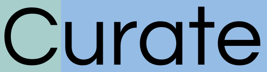

# Curate

> Find. Read. Curate

The place to find information on your next read and keep track of your past reads.

## Developing

### Built With

-   React 18.2
-   Node.js 20.9
-   Express.js 4.18
-   MySQL 8.1

## API Reference

Powered by [Open Library API](https://openlibrary.org/dev/docs/api/search)

## Database

MySQL 8.1
[Download](https://dev.mysql.com/downloads/mysql/)
